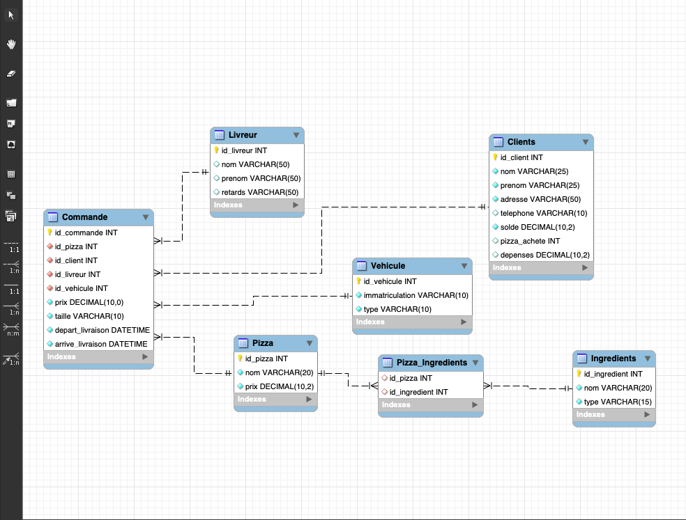
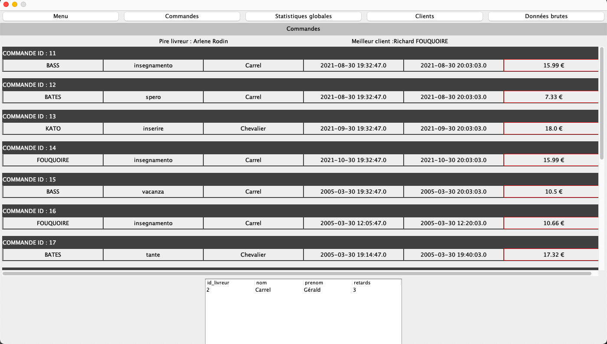
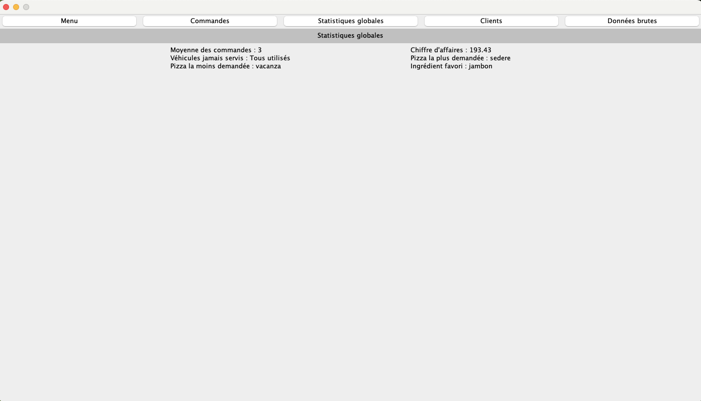
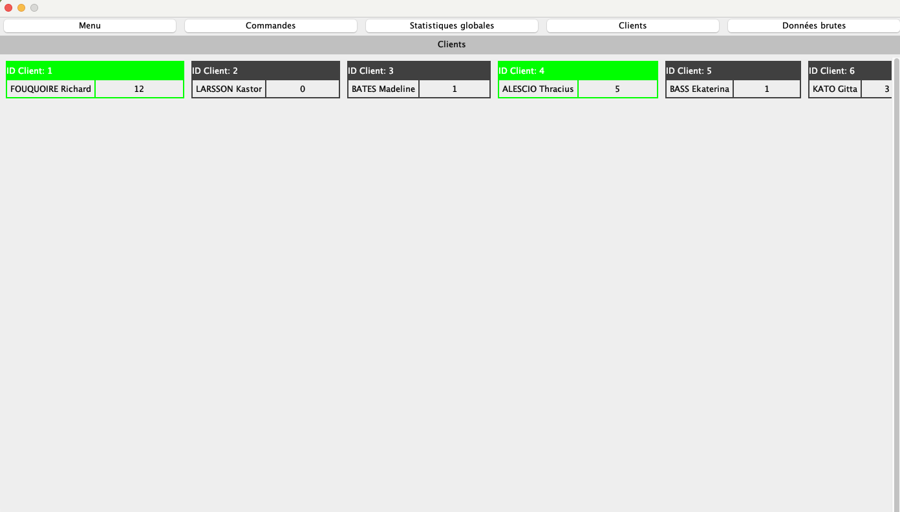
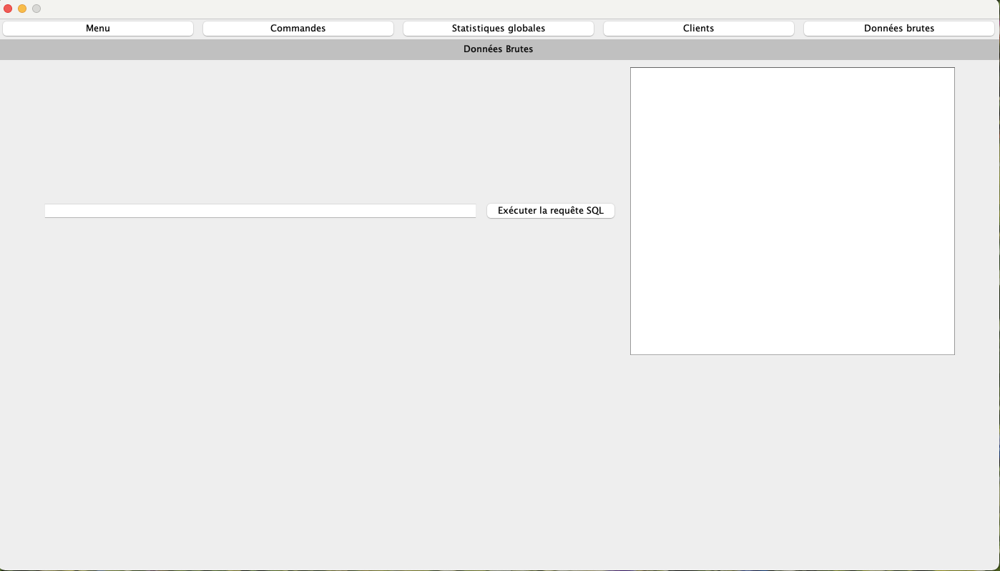

# 3I_IN10_RaPizz
**20_E3FI_3I_IN10 - Base de données**

*Richard FOUQUOIRE & Emily RENARD*

Projet de base de données représentant la gestion d'une entreprise de fabrication et de livraison de pizzas à domicile.

**Faire fonctionner la base de données**

Sous mysql, lancer le script create_tables.sql qui permet de créer la base de données et les tables correspondantes au projet.
Lancer ensuite le script insert_data.sql pour insérer les données des clients, pizzas, ingrédients etc dans les tables.

Voici les identifiants utilisés pour se connecter à la base:
**USER** : Admin
**PASSWORD :**  RichardEtEmilyMeritentUn20sur20

**Présentation du modèle de la base**

**Présentation du modèle MVC**

Notre projet suit le modèle MVC avec nos classes "modèle" pour le MODEL, la classe IHM pour la VIEW et JdbcConnectDB le CONTROLER, la classe principale 
via laquelle se lance le programme.

**Présentation de l'IHM**

Notre IHM se compose de 5 onglets :
 - Menu, où se retrouve la liste des pizzas avec les ingrédients qui les composent et leurs prix par taille.
 
 - Commandes, regroupant toutes les informations des commandes avec des champs cliquables ! Il faut cliquer sur une des cases (la pizza, le client, le livreur) pour
 afficher les détails du champ dans une JTable en bas de l'IHM.

- Statistiques globales, regroupant des statistiques utiles pour le suivi du business (chiffre d'affaires, client le plus actif etc).

- La liste des clients, avec en vert les clients les plus rentables.

- Données brutes, onglet qui permet de saisir des requêtes SQL dans un champ afin de connaître en détails la composition de la base de données.
